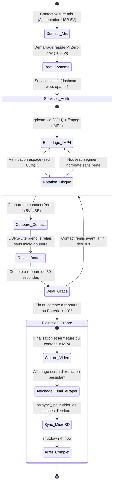

# 🚗 Pi-Dashcam

Système de **dashcam automobile embarquée autonome et connectée**, conçu pour **Raspberry Pi Zero 2 W**, équipé d'un module d'alimentation sans coupure **UPS-Lite V1.2**, d'un **écran à encre électronique Waveshare 2.13" e-Paper HAT V4**, d'une **caméra grand angle 160°** et d'une **interface Web mobile (Point d'accès Wi-Fi)** pour smartphone.

---

## 📋 Sommaire

- [Vue d'ensemble](#-vue-densemble)
- [Matériel requis & Détails](#-matériel-requis--détails)
- [Architecture & Fonctionnement](#-architecture--fonctionnement)
- [Câblage & Brochage GPIO (UPS-Lite + e-Paper)](#-câblage--brochage-gpio-ups-lite--e-paper)
- [Vidéo & Encodage fMP4 Anti-Corruption](#-vidéo--encodage-fmp4-anti-corruption)
- [Écran e-Paper 2.13" V4](#-écran-e-paper-213-v4)
- [Connexion Smartphone & Dashboard Web](#-connexion-smartphone--dashboard-web)
- [Installation pas-à-pas](#-installation-pas-à-pas)
- [Configuration (`dashcam.conf`)](#-configuration-dashcamconf)
- [Passage du mode Bureau au mode Voiture](#-passage-du-mode-bureau-au-mode-voiture)
- [⚡ Que se passe-t-il si l'on débranche le 5V USB ?](#-que-se-passe-t-il-si-lon-débranche-le-5v-usb-)
- [Commandes Utiles & Diagnostics](#-commandes-utiles--diagnostics)
- [Dépannage & Bonnes Pratiques](#-dépannage--bonnes-pratiques)

---

## 🎯 Vue d'ensemble

Pi-Dashcam transforme un Raspberry Pi Zero 2 W en une caméra de bord moderne, fiable et intuitive :
- **Démarrage automatique au contact** : dès que la voiture met le contact (alimentation USB 5V), le Pi s'allume et commence à filmer automatiquement.
- **Enregistrement continu en conteneur fMP4 (Fragmented MP4)** : découpage en séquences régulières (ex. 3 minutes, 1080p @ 30 fps) sans aucune coupure entre les clips. Grâce au format fMP4, les vidéos sont lisibles immédiatement sur smartphone et **100% résistantes aux coupures de courant**.
- **Affichage tête haute e-Paper 2.13"** : affichage lisible en plein soleil (statut REC, heure, IP Wi-Fi, batterie, espace disque, température CPU) et **écran persistant hors tension** à 0 Watt quand la voiture est éteinte.
- **Rotation circulaire de la carte SD** : purge automatique des clips les plus anciens dès que la carte mémoire dépasse 85% d'occupation.
- **Interface Web mobile tactile** : point d'accès Wi-Fi sécurisé pour consulter la télémétrie en direct, vérifier le cadrage de la caméra, visionner ou télécharger les vidéos sans jamais retirer la carte microSD.
- **Extinction propre et sécurisée** : sur coupure du 5V, l'UPS-Lite prend le relais sans redémarrage, laisse un délai de grâce (30 s), ferme proprement le flux vidéo, synchronise les disques (`sync`) puis éteint le système.

---

## 🛠 Matériel requis & Détails

| Composant | Description | Rôle |
| :--- | :--- | :--- |
| **Raspberry Pi Zero 2 W** | CPU Quad-core 64-bit Cortex-A53, 512 Mo RAM | Unité centrale & encodage matériel H.264 |
| **UPS-Lite V1.2** | Carte batterie LiPo 1000 mAh avec 4 pogo-pins | Relais d'alimentation sans coupure (I2C) |
| **MAX17040G** | Puce jauge de batterie embarquée sur l'UPS-Lite | Télémétrie tension (V) et pourcentage (%) via I2C (`0x36`) |
| **Waveshare 2.13" e-Paper HAT V4** | Écran à encre électronique 250x122 pixels | Affichage tête haute et écran d'arrêt persistant (SPI) |
| **Caméra 160° FOV** | Capteur grand angle avec nappe souple CSI Pi Zero | Capture panoramique de la route |
| **Boîtier & Support 3D** | Boîtier pour Pi Zero + support orientable pare-brise | Maintien mécanique et fixation dans le véhicule |
| **Carte MicroSD** | Carte haute endurance (ex. SanDisk High / Max Endurance) | Système et stockage des séquences vidéo |
| **Alimentation 5V USB** | Adaptateur allume-cigare USB (5V $\ge$ 2.4A) | Alimentation principale du système |

---

## 🔄 Architecture & Fonctionnement



---

## 🔌 Câblage & Brochage GPIO (UPS-Lite + e-Paper)

Le module **UPS-Lite V1.2** se monte sous le Pi Zero via ses 4 broches pogo dorées, tandis que l'écran **Waveshare e-Paper HAT** s'enfiche sur le dessus du connecteur GPIO.

Il n'y a **strictement aucun conflit de broches** entre les deux cartes :

| Module | Broche Physique | Nom GPIO / BCM | Fonction |
| :--- | :--- | :--- | :--- |
| **UPS-Lite V1.2** | Pin 2 | `5V` | Alimentation principale 5V |
| **UPS-Lite V1.2** | Pin 6 | `GND` | Masse |
| **UPS-Lite V1.2** | Pin 3 | `GPIO 2 (SDA)` | Ligne de données I2C (MAX17040G, `0x36`) |
| **UPS-Lite V1.2** | Pin 5 | `GPIO 3 (SCL)` | Ligne d'horloge I2C |
| **UPS-Lite V1.2** | Pin 7 | `GPIO 4` | Détection USB 5V (1 = Branché, 0 = Débranché) via pont de soudure |
| **e-Paper HAT V4** | Pin 1 | `3.3V` | Alimentation logique de l'écran |
| **e-Paper HAT V4** | Pin 9 | `GND` | Masse écran |
| **e-Paper HAT V4** | Pin 19 | `GPIO 10 (MOSI)` | Données SPI |
| **e-Paper HAT V4** | Pin 23 | `GPIO 11 (SCLK)` | Horloge SPI |
| **e-Paper HAT V4** | Pin 24 | `GPIO 8 (CE0)` | Chip Select matériel SPI (géré automatiquement par le noyau) |
| **e-Paper HAT V4** | Pin 22 | `GPIO 25` | Sélection Commande / Données (DC) |
| **e-Paper HAT V4** | Pin 11 | `GPIO 17` | Reset matériel écran (RST) |
| **e-Paper HAT V4** | Pin 18 | `GPIO 24` | Détection d'état occupé (BUSY) |

> [!TIP]
> **Activation de la détection d'alimentation USB (Soudure UPS-Lite V1.2)** :
> D'usine, le circuit de détection du chargeur n'est pas relié au GPIO 4 pour laisser la broche libre si non utilisée.
> Pour activer la détection instantanée de coupure contact :
> 1. Démontez l'UPS-Lite. Au dos du circuit imprimé (côté composants), repérez les **deux petits plots cuivrés (pads) côte à côte étiquetés PAD1 / PAD2** (proches de la prise micro-USB de charge).
> 2. Déposez une **petite goutte d'étain** pour relier (ponter) ces deux plots.
> 3. Remontez l'UPS-Lite sur le Pi Zero.
> 
> Dès cet instant :
> - **5V USB branché** : le GPIO 4 passe à **`1` (HIGH)**.
> - **5V USB débranché** : le GPIO 4 retombe immédiatement à **`0` (LOW)**.
> La détection est instantanée, insensible au niveau de charge de la batterie, et permet de déclencher l'extinction propre à la seconde près.

> [!IMPORTANT]
> **Connexion de la nappe caméra** : Sur le connecteur CSI du Pi Zero, insérez la nappe délicatement avec les **pistes dorées orientées vers la face inférieure** (vers le circuit imprimé du Pi, face opposée au loquet noir).

---

## 🎬 Vidéo & Encodage fMP4 Anti-Corruption

Sur une dashcam de véhicule, les fichiers MP4 traditionnels posent un problème majeur : si l'alimentation est coupée brutalement, le fichier devient illisible car l'index (`moov atom`) n'a pas été écrit à la fin du fichier.

Pi-Dashcam résout ce problème avec un pipeline Unix optimisé sans surcoût CPU :

```text
[ Capteur 160° ] 
       │
       ▼
[ rpicam-vid ] ──── (Encodage H.264 matériel via GPU VideoCore IV, 0% CPU)
       │ (Flux brut Annex-B)
       ▼
[   ffmpeg   ] ──── (-c:v copy : multiplexage ultra-léger sans réencodage, <1% CPU)
       │ (Options : movflags=+faststart+frag_keyframe+empty_moov)
       ▼
[ Fichier .mp4 ] ── Conteneur MP4 Fragmenté (fMP4) lisible en direct sur Safari / Chrome / VLC
```

### Avantages du format fMP4 :
- **Résistance totale aux coupures** : Chaque image-clé (*keyframe*) contient ses propres métadonnées. Même si le Pi est débranché en plein milieu d'une séquence, **la vidéo reste 100% lisible jusqu'à la dernière seconde**.
- **Compatibilité universelle** : Lecture fluide et native sur iOS (Safari), Android (Chrome), Windows Media Player et VLC.
- **Zéro perte d'image entre les clips** : Découpage transparent sur frontière I-Frame.

### Réparation / Conversion manuelle d'anciens flux bruts :
Si vous possédez d'anciennes vidéos enregistrées en flux brut H.264 (souvent renommées en `.mp4` mais sans conteneur lisible par les navigateurs), vous pouvez les ré-encapsuler instantanément sans aucune perte de qualité :
```bash
# Convertir un fichier unique :
ffmpeg -f h264 -i /var/media/dashcam/ancienne_video.mp4 -c:v copy -movflags +faststart /var/media/dashcam/video_reparee.mp4

# Convertir tous les anciens fichiers du dossier en un seul script :
cd /var/media/dashcam
for f in *.mp4; do
  ffmpeg -f h264 -i "$f" -c:v copy -movflags +faststart "fixed_$f" -y && mv "fixed_$f" "$f"
done
```

---

## 📟 Écran e-Paper 2.13" V4

L'écran à encre électronique **Waveshare 2.13inch e-Paper HAT (V4)** offre une lisibilité exceptionnelle en plein soleil derrière le pare-brise.

### 1. Affichage tête haute en conduite (rafraîchissement partiel toutes les 20s) :
- **Badge caméra** : `[● REC]` en noir inversé quand l'enregistrement est actif, ou `[⏸ PAUSE]`.
- **Heure courante** : `HH:MM`.
- **Réseau** : Adresse IP du Wi-Fi (`10.42.0.1` ou IP box).
- **Alimentation** : `⚡ 95% (4.1V)` sous alimentation USB 5V ou `🔋 XX%` sur batterie.
- **Stockage MicroSD** : Espace libre en Go et jauge graphique d'occupation.
- **Température CPU** : Affichage en direct (~40°C au repos, ~60°C en capture).

### 2. Écran persistant hors tension (Zéro consommation) :
À la coupure du contact et après extinction du Pi, l'écran bascule sur un écran dédié :
```text
===========================
    PI-DASHCAM ÉTEINT
  Arrêt sécurisé terminé
   Batterie restante : 94%
===========================
```
Grâce aux micro-billes d'encre électronique bistables, cet écran **reste affiché indéfiniment sur votre pare-brise sans consommer le moindre milliwatt**.

---

## 📱 Connexion Smartphone & Dashboard Web

Aucune application mobile n'est requise. Tout se pilote depuis le navigateur web de votre smartphone.

### 1. Connexion au Wi-Fi de la Dashcam
- **Nom du réseau (SSID)** : `Pi-Dashcam`
- **Mot de passe** : `dashcam1234`
- **Adresse du dashboard** : **`http://10.42.0.1:5000`** (ou `http://192.168.4.1:5000`)

### 2. Fonctionnalités de l'Interface Mobile :
- 📊 **Tableau de bord** : Télémétrie en temps réel (mise à jour toutes les 3s) avec tension batterie, badge `⚡ USB 5V Branché` / `⚠️ Sur Batterie LiPo`, jauge microSD et température.
- 📸 **Aide au cadrage** : Capture instantanée avec ligne d'horizon superposée pour orienter la rotule de la caméra face au capot.
- 🎬 **Galerie Vidéos** : Lecteur HTML5 intégré avec boutons de téléchargement direct sur la pellicule du smartphone et suppression de clips.
- ⚙️ **Réglages** : Modification en un clic de la durée des séquences (1, 3, 5 min), de la définition (1080p ou 720p) et du délai d'extinction.

---

## 🚀 Installation pas-à-pas

### 1. Préparer la carte MicroSD avec Raspberry Pi Imager
- **OS** : `Raspberry Pi OS (other)` -> **`Raspberry Pi OS Lite (64-bit)`** (Bookworm).
- **Personnalisation (`Ctrl + Shift + X`)** :
  - Nom d'hôte : `pi-dashcam`
  - Identifiant & mot de passe (ex. `pi` / `raspberry`)
  - Wi-Fi : Renseignez le Wi-Fi de votre domicile / box
  - Services : Cochez **Activer SSH**

### 2. Déployer le projet sur le Pi
Une fois le Pi démarré et connecté à votre box :

```bash
# 1. Cloner le dépôt sur le Pi
git clone https://github.com/<votre-user>/pi-dashcam.git
cd pi-dashcam

# 2. Rendre l'installateur exécutable et lancer le déploiement
chmod +x install.sh
sudo ./install.sh
```

Le script `install.sh` s'occupe de tout :
- Activation des bus **I2C** et **SPI** dans `/boot/firmware/config.txt`.
- Installation des paquets système (`python3-pil`, `python3-spidev`, `python3-flask`, `ffmpeg`, `dnsmasq-base`).
- Déploiement de l'application Web dans `/opt/pi-dashcam/web`.
- Configuration des dossiers et des services systemd (`dashcam.service`, `dashcam-web.service`, `dashcam-epaper.service`).
- Sécurisation de l'extinction automatique (laissée inactive pour vos tests).

### 3. Activer le point d'accès Wi-Fi
```bash
sudo setup_hotspot.sh enable
```

Redémarrez le Raspberry Pi pour finaliser la configuration des interfaces matérielles :
```bash
sudo reboot
```

---

## ⚙️ Configuration (`dashcam.conf`)

Tous les réglages sont centralisés dans `/etc/pi-dashcam/dashcam.conf` :

```ini
# Emplacement de stockage des vidéos
STORAGE_DIR="/var/media/dashcam"

# Durée de chaque segment en secondes (180 = 3 minutes)
SEGMENT_DURATION_SEC=180

# Définition vidéo et fluidité
VIDEO_WIDTH=1920
VIDEO_HEIGHT=1080
VIDEO_FPS=30

# Débit d'encodage H.264 (8 Mbps recommandé pour un excellent piqué d'image)
VIDEO_BITRATE=8000000

# Seuil de saturation du disque avant rotation automatique (%)
MAX_DISK_USAGE_PERCENT=85

# Mode extinction automatique (0 = Désactivé pour le bureau, 1 = Activé pour la voiture)
ENABLE_AUTO_SHUTDOWN=0

# Délai de grâce avant extinction lors d'une coupure du 5V USB (secondes)
SHUTDOWN_DELAY_SEC=30

# Seuil critique de sécurité LiPo (%)
CRITICAL_BATTERY_PERCENT=10

# Paramètres Wi-Fi Hotspot & Web
HOTSPOT_SSID="Pi-Dashcam"
HOTSPOT_PASS="dashcam1234"
WEB_PORT=5000

# Écran e-Paper 2.13" V4
EPAPER_ENABLED=1
EPAPER_REFRESH_SEC=20
```

---

## 🚗 Passage du mode Bureau au mode Voiture

Pendant la phase de développement sur votre bureau, le système est configuré pour **ne jamais s'éteindre tout seul** (`ENABLE_AUTO_SHUTDOWN=0`).

Lorsque vous êtes prêt à installer la dashcam dans votre véhicule avec le module UPS-Lite et sa batterie branchés :

1. Éditez le fichier de configuration :
   ```bash
   sudo nano /etc/pi-dashcam/dashcam.conf
   ```
2. Modifiez la ligne suivante :
   ```ini
   ENABLE_AUTO_SHUTDOWN=1
   ```
3. Activez le service de surveillance d'alimentation :
   ```bash
   sudo systemctl enable --now power-monitor.service
   ```

---

## ⚡ Que se passe-t-il si l'on débranche le 5V USB ?

L'adaptateur 12V allume-cigare alimente le Pi en **5V USB**. Voici exactement le comportement selon le mode configuré :

### Cas 1 : En Mode Bureau / Développement (`ENABLE_AUTO_SHUTDOWN=0`)
- Le Pi **ne s'éteint pas**.
- L'alimentation bascule instantanément sur la batterie LiPo 1000 mAh de l'UPS-Lite sans micro-coupure ni redémarrage.
- Le dashboard web indique `⚠️ Sur Batterie LiPo` et affiche la tension réelle de la cellule (ex. 3.95V).
- Le système continue d'enregistrer, de diffuser le Wi-Fi et de rafraîchir l'e-Paper jusqu'à épuisement complet de la batterie (~1h15 à 1h30 d'autonomie).
- Idéal pour configurer, développer, extraire des fichiers ou faire des tests sur table sans être interrompu.

### Cas 2 : En Mode Voiture (`ENABLE_AUTO_SHUTDOWN=1` & `power-monitor.service` actif)
Dès que vous coupez le contact de la voiture :
1. **Prise de relais instantanée** : L'UPS-Lite maintient le Pi Zero 2 W sous tension (0 milliseconde de coupure).
2. **Détection de la coupure 5V** : Le service `power-monitor` détecte la perte du 5V externe (la tension batterie passe sous le seuil de 4.02V).
3. **Temporisation de grâce (30 secondes par défaut)** :
   - Un compte à rebours de 30 secondes démarre.
   - *Si vous remettez le contact avant 30 secondes* (ex: calage, arrêt rapide à la pompe, redémarrage du moteur), la procédure d'extinction est automatiquement annulée et l'enregistrement continue normalement.
4. **Arrêt gracieux et sécurisé** (à l'échéance des 30s) :
   - **Clôture vidéo** : Envoi d'un signal `SIGTERM` au processus d'enregistrement. `ffmpeg` finalise proprement le conteneur fMP4 en écrivant la dernière frame et les index de segment.
   - **Affichage persistant** : L'écran e-Paper affiche l'écran de veille *"PI-DASHCAM ÉTEINT - Arrêt sécurisé terminé"* avec le pourcentage de batterie restante.
   - **Protection de la carte MicroSD** : Exécution d'un `sync` système pour flusher l'intégralité des tampons d'écriture en mémoire vers la carte Flash.
   - **Extinction matérielle** : Lancement de `shutdown -h now`. Le système est hors tension en toute sécurité, la carte SD ne peut pas être corrompue.

---

## 🔍 Commandes Utiles & Diagnostics

```bash
# Vérifier l'état de la batterie et de l'alimentation
python3 /usr/local/bin/power_monitor.py --status

# Vérifier la présence de la jauge batterie I2C (adresse 0x36)
i2cdetect -y 1

# Consulter les données de télémétrie de l'API web
curl -s http://localhost:5000/api/status

# Suivre les journaux d'enregistrement vidéo en direct
journalctl -u dashcam.service -f

# Suivre les journaux de l'affichage e-Paper
journalctl -u dashcam-epaper.service -f

# Suivre les journaux du serveur web mobile
journalctl -u dashcam-web.service -f

# Suivre le démon de coupure d'alimentation
journalctl -u power-monitor.service -f

# Statut du point d'accès Wi-Fi
sudo setup_hotspot.sh status
```

---

## 💡 Dépannage & Bonnes Pratiques

- **Protéger la carte MicroSD contre l'usure prématurée :**
  Les dashcams écrivent en continu sur la carte mémoire. Il est fortement recommandé d'utiliser une carte conçue pour la vidéosurveillance (**SanDisk High Endurance** ou **Max Endurance**).
  Vous pouvez ajouter l'option `noatime` dans `/etc/fstab` sur la partition racine pour éviter les écritures d'accès inutiles à chaque lecture.
- **La vidéo est noire ou la caméra ne démarre pas :**
  Vérifiez que la nappe CSI est insérée dans le bon sens (pistes dorées orientées vers la carte électronique du Pi Zero). Vous pouvez tester le capteur avec la commande `rpicam-hello -t 3000`.
- **L'adresse I2C `0x36` n'apparaît pas dans `i2cdetect -y 1` :**
  Vérifiez que les vis maintenant l'UPS-Lite au Pi Zero 2 W sont suffisamment serrées pour assurer un contact franc des 4 pogo-pins avec les pastilles sous l'en-tête GPIO.
- **Erreur `GPIO busy` ou `Device or resource busy` sur l'écran e-Paper :**
  Sous Raspberry Pi OS Bookworm, le bus SPI et les broches GPIO sont gérés de manière exclusive. Ne lancez pas `display_epaper.py` en ligne de commande si le service `dashcam-epaper.service` est déjà actif. Arrêtez d'abord le service via `sudo systemctl stop dashcam-epaper.service` si vous souhaitez faire des tests manuels.
- **Mettre à jour les fichiers du Pi depuis ce dépôt :**
  Pour déployer rapidement les modifications de code sur le Pi depuis votre machine :
  ```bash
  # Via rsync (recommandé) :
  rsync -avz --exclude '.git' ./ pi@pi-dashcam.local:~/pi-dashcam/
  # Puis sur le Pi :
  sudo cp ~/pi-dashcam/scripts/dashcam.sh /usr/local/bin/
  sudo cp ~/pi-dashcam/scripts/power_monitor.py /usr/local/bin/
  sudo cp ~/pi-dashcam/scripts/display_epaper.py /usr/local/bin/
  sudo cp -r ~/pi-dashcam/web/* /opt/pi-dashcam/web/
  sudo systemctl restart dashcam.service dashcam-web.service dashcam-epaper.service
  ```

