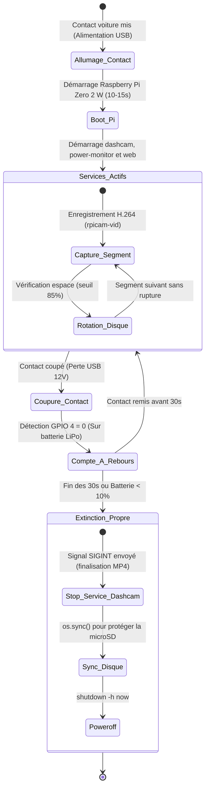

# 🚗 Pi-Dashcam

Système de **dashcam automobile embarquée autonome et sécurisée**, conçu pour **Raspberry Pi Zero 2 W**, équipé d'un module d'alimentation sans interruption **UPS-Lite V1.2**, d'une **caméra grand angle 160°** et d'une **interface Web mobile (Point d'accès Wi-Fi)** pour smartphone.

---

## 📋 Sommaire

- [Vue d'ensemble](#-vue-densemble)
- [Matériel requis & Détails](#-matériel-requis--détails)
- [Fonctionnement & Cycle de vie](#-fonctionnement--cycle-de-vie)
- [Câblage & Broches GPIO](#-câblage--broches-gpio)
- [Connexion Smartphone & Interface Web](#-connexion-smartphone--interface-web)
- [Installation rapide](#-installation-rapide)
- [Configuration (`dashcam.conf`)](#-configuration-dashcamconf)
- [Diagnostics & Commandes utiles](#-diagnostics--commandes-utiles)
- [Dépannage & Astuces](#-dépannage--astuces)

---

## 🎯 Vue d'ensemble

Pi-Dashcam transforme un Raspberry Pi Zero 2 W en une caméra de bord moderne et connectée :
- **Démarrage automatique** dès que le véhicule met le contact (alimentation USB de l'allume-cigare).
- **Enregistrement continu par segments** (par défaut 3 minutes, 1080p @ 30 fps, H.264 matériel) sans perte d'images entre deux vidéos.
- **Gestion automatique de l'espace disque** : rotation circulaire supprimant les plus anciennes vidéos lorsque la carte SD dépasse 85% de remplissage.
- **Extinction propre et sécurisée** : lors de la coupure du contact, l'UPS-Lite prend le relais sur batterie, accorde un délai de grâce (30 s), stoppe proprement l'enregistrement pour ne pas corrompre le conteneur MP4, synchronise les écritures disque (`sync`) puis éteint le Pi (`shutdown`).
- **Protection matérielle LiPo** : extinction d'urgence immédiate si la batterie passe sous les 10% ou 3.40 V.
- **Point d'accès Wi-Fi & Interface Web Mobile** : connectez directement votre smartphone (iOS / Android) en Wi-Fi dans votre voiture pour consulter la télémétrie en direct, vérifier le cadrage, modifier les réglages et visionner ou télécharger les vidéos enregistrées !

---

## 🛠 Matériel requis & Détails

| Composant | Description | Rôle |
| :--- | :--- | :--- |
| **Raspberry Pi Zero 2 W** | Processeur 64-bit quad-core, Wi-Fi/Bluetooth | Unité centrale & encodage matériel H.264 |
| **UPS-Lite V1.2** | Carte d'extension d'alimentation avec batterie LiPo | Maintien temporaire et coupure propre |
| **MAX17040G** | Puce jauge de batterie I2C embarquée sur l'UPS-Lite | Télémétrie tension (V) et pourcentage (%) |
| **Caméra 160° FOV** | Module caméra grand angle CSI avec nappe étroite Pi Zero | Capture vidéo panoramique de la route |
| **Boîtier & Support 3D** | Boîtier pour Pi Zero + support orientable caméra | Maintien mécanique et fixation pare-brise |
| **Carte MicroSD** | Carte haute endurance (ex. SanDisk High Endurance / Max Endurance) | Stockage du système et des vidéos |

---

## 📱 Connexion Smartphone & Interface Web

Aucune application à installer depuis l'App Store ou le Google Play Store !

```
+------------------+         Wi-Fi Direct / AP         +-----------------------+
|    Smartphone    | <-------------------------------> |  Raspberry Pi Zero 2W |
| (iPhone/Android) |   SSID: Pi-Dashcam                |  IP: 192.168.4.1      |
| Navigateur Web   |   http://192.168.4.1:5000         |  Serveur Flask Web    |
+------------------+                                   +-----------------------+
```

### 1. Se connecter au Wi-Fi de la Dashcam
1. Sur votre smartphone, rendez-vous dans les réglages **Wi-Fi**.
2. Connectez-vous au réseau **`Pi-Dashcam`**.
3. Mot de passe par défaut : **`dashcam1234`**.

### 2. Ouvrir le Dashboard de Contrôle
Ouvrez Safari, Chrome ou votre navigateur favori à l'adresse :
👉 **`http://192.168.4.1:5000`**

### Fonctionnalités disponibles sur l'interface mobile :
- 📊 **Tableau de bord** : Pourcentage batterie en direct, tension LiPo, détection de contact 12V vs batterie, température CPU et jauge d'espace libre.
- 📸 **Cadrage pare-brise** : Aperçu photo instantané avec ligne d'horizon superposée pour orienter précisément l'objectif lors de la pose sur le pare-brise.
- 🎬 **Galerie de vidéos** : Liste chronologique des vidéos avec taille et date. Lecture streaming directe dans le navigateur du téléphone, bouton de téléchargement direct et bouton de suppression.
- ⚙️ **Réglages** : Choix de la durée des séquences (1, 3, 5 min), définition (1080p ou 720p), délai d'extinction (15s, 30s, 60s) et redémarrage du service en 1 clic.

---

## 🔄 Fonctionnement & Cycle de vie



---

## 🔌 Câblage & Broches GPIO

Le module **UPS-Lite V1.2** se monte sous le Raspberry Pi Zero grâce à ses broches pogo (*pogo pins*) qui font contact avec les pastilles sous l'en-tête GPIO du Pi :

| Broche physique | Nom GPIO | Rôle |
| :--- | :--- | :--- |
| **Pin 1** | `3V3` | Alimentation 3.3V logique |
| **Pin 2 / 4** | `5V` | Alimentation 5V du Pi par l'UPS |
| **Pin 3** | `GPIO 2 (SDA)` | Ligne de données I2C (Jauge MAX17040, adresse `0x36`) |
| **Pin 5** | `GPIO 3 (SCL)` | Ligne d'horloge I2C |
| **Pin 6 / 9** | `GND` | Masse commune |
| **Pin 7** | `GPIO 4` | Détection présence alim externe USB (1 = Alimenté, 0 = Débranché) |

> [!IMPORTANT]
> **Connexion de la nappe caméra** : Sur le connecteur CSI du Pi Zero, insérez la nappe délicatement avec les **pistes dorées orientées vers la face inférieure** (vers le circuit imprimé du Pi, face opposée au loquet noir).

---

## 🚀 Installation rapide

### 1. Préparer la carte MicroSD avec Raspberry Pi Imager
- Choisir l'OS : **Raspberry Pi OS Lite (64-bit) - Bookworm**.
- Configurer les identifiants et activer le SSH.

### 2. Cloner et exécuter l'installateur

```bash
git clone https://github.com/<votre-user>/pi-dashcam.git
cd pi-dashcam
sudo chmod +x install.sh
sudo ./install.sh
```

### 3. Activer le Hotspot Wi-Fi
Pour activer le point d'accès Wi-Fi autonome pour votre smartphone :
```bash
sudo setup_hotspot.sh enable
```

Redémarrez le Raspberry Pi :
```bash
sudo reboot
```

---

## ⚙️ Configuration (`dashcam.conf`)

Tous les réglages sont centralisés dans `/etc/pi-dashcam/dashcam.conf` :

```ini
# Emplacement de stockage des vidéos
STORAGE_DIR="/var/media/dashcam"

# Durée de chaque segment en secondes (180 = 3 minutes)
SEGMENT_DURATION_SEC=180

# Définition vidéo et fréquence
VIDEO_WIDTH=1920
VIDEO_HEIGHT=1080
VIDEO_FPS=30

# Débit d'encodage (8 Mbps recommandé)
VIDEO_BITRATE=8000000

# Seuil de saturation du disque avant rotation (%)
MAX_DISK_USAGE_PERCENT=85

# Broche GPIO pour la détection du 5V externe (UPS-Lite V1.2)
POWER_DETECT_PIN=4

# Délai de grâce avant extinction lors d'une coupure contact (secondes)
SHUTDOWN_DELAY_SEC=30

# Seuil critique de sécurité LiPo (%)
CRITICAL_BATTERY_PERCENT=10

# Paramètres Wi-Fi Hotspot & Web
HOTSPOT_SSID="Pi-Dashcam"
HOTSPOT_PASS="dashcam1234"
HOTSPOT_IP="192.168.4.1"
WEB_PORT=5000
```

---

## 🔍 Diagnostics & Commandes utiles

### 1. Tester la jauge batterie et l'état d'alimentation
```bash
python3 /usr/local/bin/power_monitor.py --status
```

### 2. Vérifier la communication I2C
```bash
i2cdetect -y 1
```
*(L'adresse `36` doit apparaître dans la grille).*

### 3. Statut du point d'accès Wi-Fi
```bash
sudo setup_hotspot.sh status
```

### 4. Consulter les journaux en direct
```bash
# Enregistrement vidéo et rotation disque :
journalctl -u dashcam.service -f

# Détection contact et gestion batterie :
journalctl -u power-monitor.service -f

# Serveur Web et requêtes mobile :
journalctl -u dashcam-web.service -f
```

---

## 💡 Dépannage & Astuces

- **L'adresse I2C `0x36` n'apparaît pas dans `i2cdetect` :**
  - Vérifiez que les vis maintenant l'UPS-Lite au Pi Zero sont bien serrées. Les pogo pins doivent être fermement en contact avec les pastilles dorées sous le GPIO.
  - Vérifiez que `dtparam=i2c_arm=on` est présent dans `/boot/firmware/config.txt` et redémarrez.
- **La vidéo ne démarre pas (`rpicam-vid` not found) :**
  - Installez `rpicam-apps` via `sudo apt-get install rpicam-apps`.
  - Testez le capteur caméra avec la commande `rpicam-hello -t 3000`.
- **Prolonger la durée de vie de la carte MicroSD :**
  - Utilisez une carte conçue pour dashcam / vidéosurveillance (**High Endurance**).
  - Ajoutez l'option `noatime` dans `/etc/fstab` sur la partition racine pour éviter les écritures inutiles à chaque lecture de fichier.
